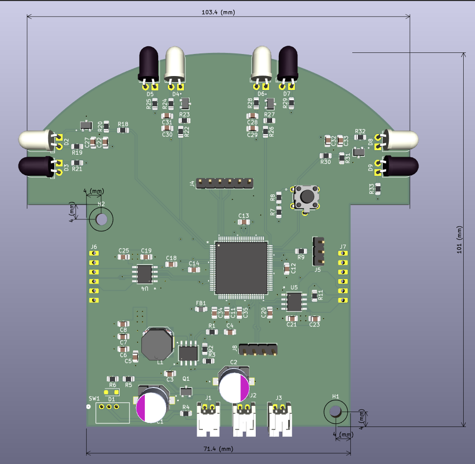
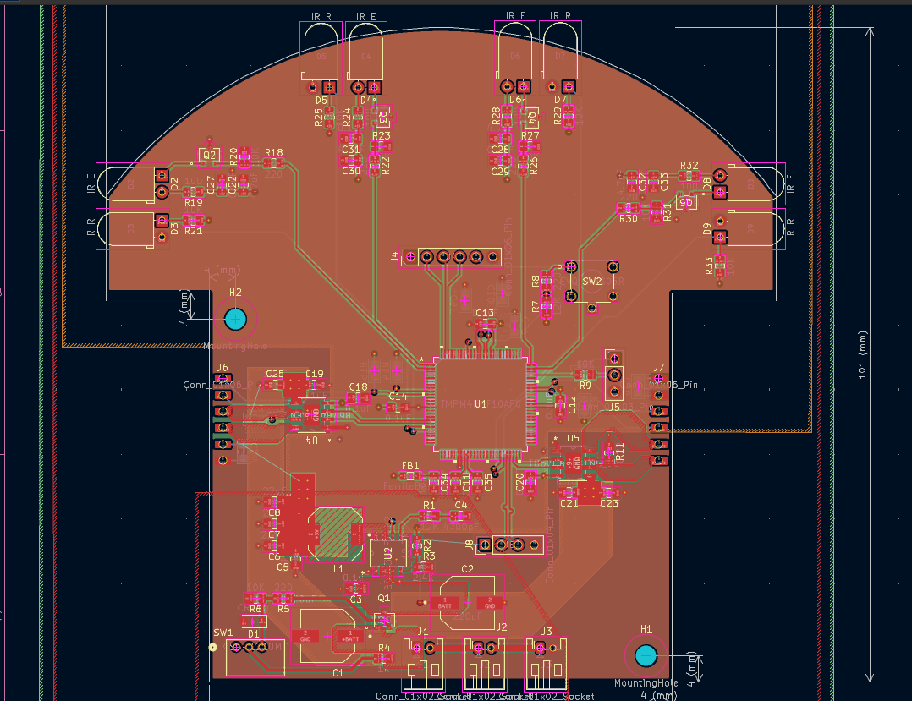

# Micromouse PCB

**Custom 4-Layer Control Board**  
*Integrated MCU, motor drivers, and IR sensing*

---

## Overview

The mainboard is a custom 4-layer PCB designed in KiCad that carries the full electronics stack on a single micromouse-sized board: the microcontroller, dual motor drivers, four IR wall sensors, and the power and debug interface.

---

## Board Specs

| Spec | Detail |
|------|--------|
| Layers | 4-layer |
| MCU | Toshiba TMPM4KNF10AFG (Cortex-M4F) |
| Motor drivers | 2 × TB67H450AFNG H-bridge |
| Sensing | 4 × IR emitter / receiver pairs |
| Debug | CMSIS-DAP (SWD) via TXB0104 level shifter |
| Supply | 5 V |

---

## Layout

*Copper layers and component placement*

---

## Key Components

| Component | Part | Role |
|-----------|------|------|
| MCU | TMPM4KNF10AFG | Cortex-M4F — control & sensing |
| Motor driver | TB67H450AFNG ×2 | Brushed DC H-bridge, PWM speed control |
| Motors | Pololu #5211 N20 30:1 | Drive, with quadrature encoders |
| IR sensing | IR LED + phototransistor ×4 | Wall detection via ADC |
| Level shifter | TXB0104 | 5 V ↔ 3.3 V for SWD debug |

---

## Bench Setup

External equipment used for programming and debug:

 &nbsp;&nbsp; 

*SWD debug via level shifter, and USB-UART for serial logging*

| Equipment | Purpose |
|-----------|---------|
| CMSIS-DAP probe | SWD programming & debug |
| Logic level shifter | 5 V ↔ 3.3 V for the SWD lines |
| USB-UART converter | Serial console (115200 8-N-1) over the CH340G/debug UART |

---

## Schematic

The full schematic is available as a PDF:

[View schematic (PDF)](Schematic.pdf)

---

## Design Files

| File | Contents |
|------|----------|
| [`TMPM4KNF10AFG.kicad_sch`](TMPM4KNF10AFG.kicad_sch) | Schematic source (KiCad) |
| [`TMPM4KNF10AFG.kicad_pcb`](TMPM4KNF10AFG.kicad_pcb) | Board layout source (KiCad) |
| [`Schematic.pdf`](Schematic.pdf) | Rendered schematic |
| [`board.step`](board.step) | 3D board model (STEP) |
| [`BOM.csv`](BOM.csv) | Bill of materials |
| [`gerber/`](gerber/) | Fabrication outputs |

---

[← Back to main README](../README.md)

