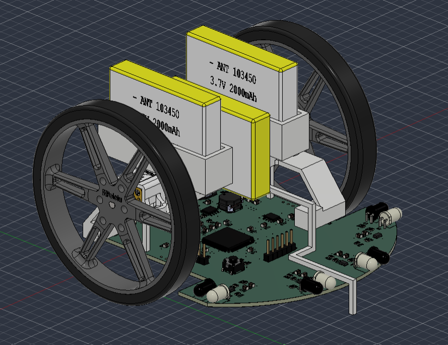

# Toshiba Micromouse 🐭

> A from-scratch, register-level firmware for an autonomous **IEEE 16×16 micromouse** — a palm-sized robot that maps a maze on its own, finds the center, then races back through the fastest route it found.

<p align="center">
  
  <br>
  <em>Hero photo of the mouse goes here</em>
</p>

---

## Overview

Micromouse is a classic robotics challenge: an autonomous robot explores a 16×16 grid maze, discovers the walls, solves for the center, and then runs a timed pass along the best path it found.

## Platform: Toshiba TMPM4KNF10AFG

The TMPM4KNF10AFG is an ARM Cortex-M4F microcontroller from Toshiba's M4K
family, a line engineered for motor and inverter control. It pairs the
Cortex-M4 core — with its single-precision FPU and DSP instructions for
real-time control math — with Toshiba's motor-control peripheral set:
programmable timers capable of driving three-phase inverter bridges with
complementary PWM, hardware dead-time insertion, and fault-triggered
emergency shutdown, alongside on-chip quadrature encoder decoders (A-ENC32)
and ADC units with hardware-synchronized triggering for inline current and
position sensing.

These are the building blocks of field-oriented control (FOC), which is why
the family is used across industrial and consumer motion systems: brushless
(BLDC) and permanent-magnet synchronous (PMSM) motor drives in appliances,
pumps, fans, HVAC compressors, power tools, and factory automation, where
efficient closed-loop control of a three-phase motor is the core workload.

**In this project**, the same silicon drives a smaller-scale motion problem:
two brushed DC gear-motors through H-bridges under a 1 kHz closed-loop PID,
with the on-chip A-ENC32 decoders handling wheel feedback and the
trigger-driven ADC path handling IR wall sensing. The peripheral set built
for industrial three-phase drives maps cleanly onto a micromouse — encoder
counting and motor PWM run as dedicated hardware, leaving the core free for
navigation and maze-solving.

**Highlights**

- Flood-fill maze solver — pure logic, no hardware coupling
- 1 kHz per-wheel PID speed control
- Fully hand-written HAL, register-level, from the datasheets
- Custom 4-layer PCB
- Relative-move navigation, so turn error never compounds across a run

---

## Built With

<p align="center">
  
  &nbsp;&nbsp;&nbsp;
  
  &nbsp;&nbsp;&nbsp;
  
  &nbsp;&nbsp;&nbsp;
  
  &nbsp;&nbsp;&nbsp;
  
  &nbsp;&nbsp;&nbsp;
  
</p>

| Tool | Used for |
|------|----------|
| **Keil µVision** | Firmware IDE, build & flash (CMSIS-DAP) |
| **KiCad** | 4-layer PCB design |
| **Fusion 360** | Chassis & mechanical CAD |
| **C / Cortex-M4** | Register-level embedded firmware |
| **Git** | Version control |

---

## Gallery

<p align="center">
  
  &nbsp;&nbsp;
  
  <br>
  <em>PCB and maze run — replace with your own images</em>
</p>

---
 
## Mechanical Design

The chassis was designed in Fusion 360. A render of the full assembly:

<p align="center">
  
  <br>
  <em>Fusion 360 render of the micromouse assembly with Chassis</em>
</p>

---
 
## Documentation

The full technical breakdown — architecture, control-loop stages, pin map, timer configuration, and module status — lives in the source tree:

**[`src/README.md`](src/README.md)** — architecture & module reference

Other locations:

- [`pcb/`](pcb/) — KiCad design files
- [`src/drivers/`](src/drivers/) — register-level hardware layer
- [`src/modules/`](src/modules/) — application logic (control, planner, navigation)

---

## Quick Start

```text
IDE:     Keil µVision
Target:  TMPM4KNF10AFG
Debug:   CMSIS-DAP
Flash:   On-chip 512 KB
```

---

<p align="center">
  <strong>Kevin Le</strong> &nbsp;•&nbsp; 2026 &nbsp;•&nbsp; Work in progress
</p>